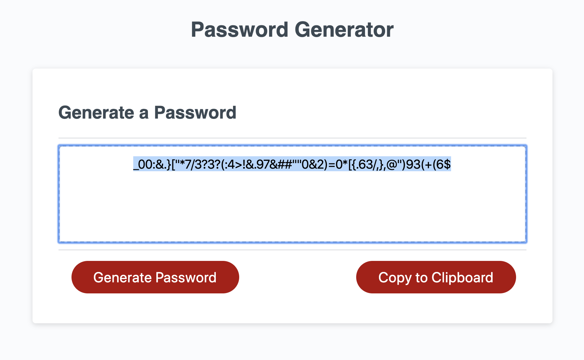

# pw-gen3
3rd password generator based on newly provided base files for assignment

The user will be prompted to choose from the following password criteria:
* Length between 8 and 128 characters
* Character type:
  * Special characters
  * Numeric characters
  * Lowercase characters
  * Uppercase characters
  
Once all prompts are answered, the user will be presented with a password matching the answered prompts. 

https://firefreet.github.io/pw-gen3/

